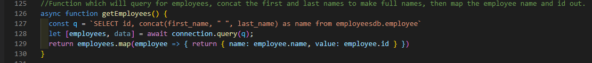
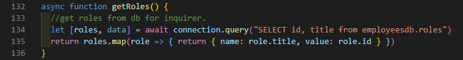

# Employee_Management_System

An app for managing a company's employees and storing to a database using node, inquirer, and MySQL.
## Table of Contents:
  - [Installation](#Installation)
  - [Usage](#Usage)
  - [License](#License)
  - [Breakdown](#Breakdown)
  - [Tests](#Tests)
  - [Questions](#Questions)
  ## Installation
  Have node installed, and run an "npm i" to install all requirements. Project requires MySQL, inquirer, and console.table. 
  ## Usage
  Through a command line application using node, the app will prompt the user whether they want to add an employee, update their employee's info, or view all their employees.  The user simply selects or inputs an employee/role depending on what is asked in the prompts.
  ## License
  MIT
  ## Breakdown
  - Database:
  
  
  
  - Database seed:
  
  
  
  - Code to create and start server.  Requires a connection with sql.  Also additional code that requires inquirer and console.table for functionality.
  
  
  
  - Contains call of startup function which wraps the whole code and starts the app.  Also contains start function, which brings up the first prompt where the user can choose to add, update or view employees, and an exit choice to end the app.  Depending on the answer, it will trigger a case within the switch function, which calls other functions with prompts specific to that choice.
  
  
  
  - Calls a getRoles function which brings up the query (explained below).  Brings up prompts to ask for new employee information stored in the const employeeAnswers.  Once answered, querys the data base to insert the employeeAnswers into the database.  Ends by calling start function to take user back to initial prompt.
  
  
  
  - Calls getEmployees function and getRoles (both explained below), which brings in queries.  Prompts the users for questions pertaining to update the employee. It will bring up a list containing the employees full name through the employeeRows const, and a list of roles to update to within the roles const.  Once answered, a query is made to the database to update employees at role_id and id, using the employeeUpdate const which will contain the answers from the user.  Ends by calling start function, which will bring the user back to the inital prompt.
   
  
  
  
  
  
  
  
  
  ## Tests
  
  ## Questions
  For any questions, [mailto:alexisayyid@gmail.com], or visit my [GitHub] (https://github.com/aisayyid) 
  ### Video Demo
  https://drive.google.com/file/d/1_NTJEjSS7SVL7mihy2RPM3SaQi3ggH9j/view
